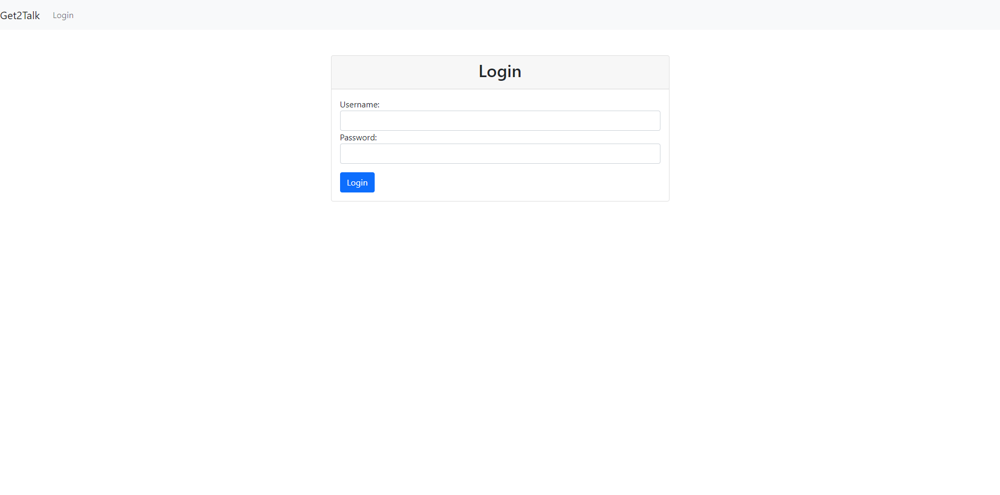
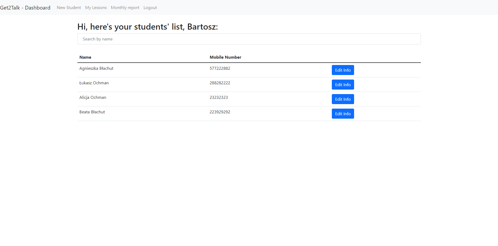
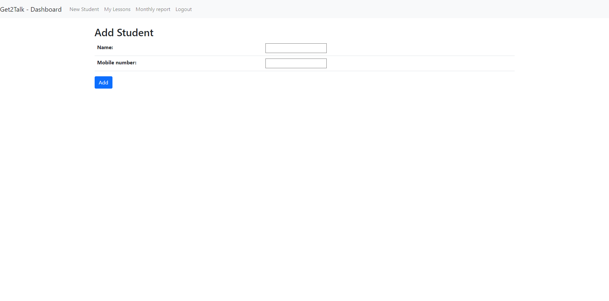
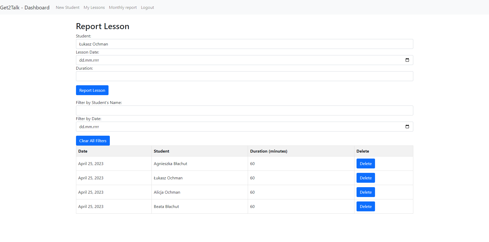
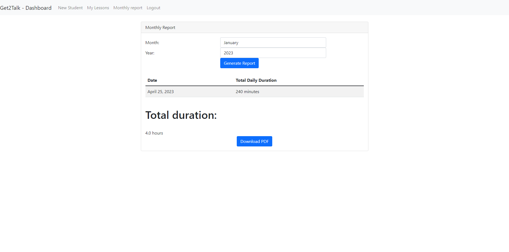
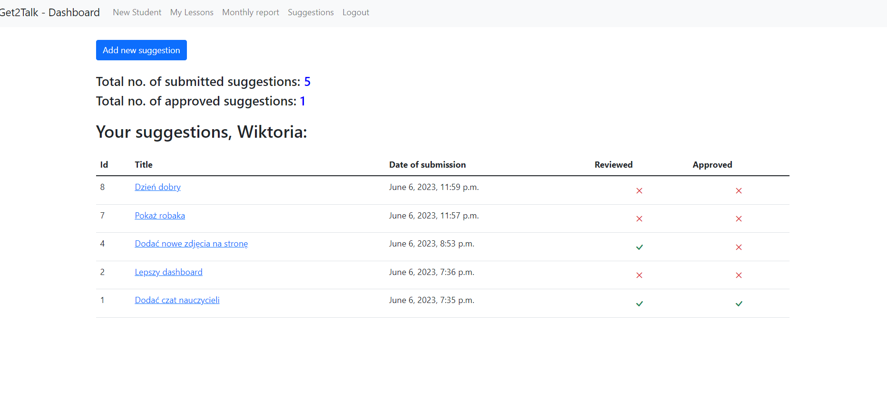

# Get2TalkAPP2
Language school staff management app.
> Working app [_here_](http://systenconti.pythonanywhere.com)

## Table of Contents
* [General Info](#general-information)
* [Technologies Used](#technologies-used)
* [Features](#features)
* [Screenshots](#screenshots)
* [Project Status](#project-status)
* [Features to add](#features-to-add)
* [Contact](#contact)

## General Information
App was created specially for Get2Talk language school. The owner needed a tool for
easier staff management. App allows teachers to: modify students' list, report lessons, add suggestions to contribute to company's growth,
download monthly working hours report based on the time and dates of conducted lessons. App is
fully functional and deployed to pythonanywhere.com.

## Technologies Used
- Python - version 3.11
- Django - version 4.2
- psycopg2-binary - version 2.9.6

## Screenshots

## Features
- Add and edit students
- Download monthly report PDF
- Report lesson for particular student

## Project Status
Project is: _in progress_ 

## Features to add
- Teacher's chat

## Contact
Created by [@systenconti](https://github.com/systenconti) - feel free to contact me!
